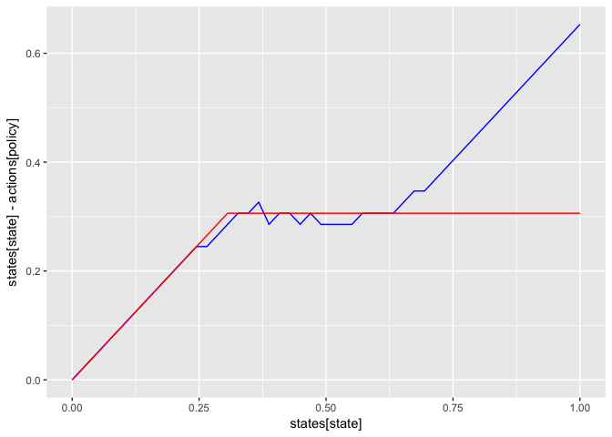
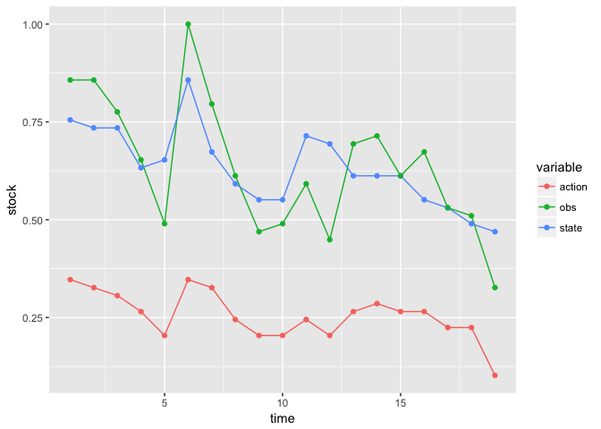
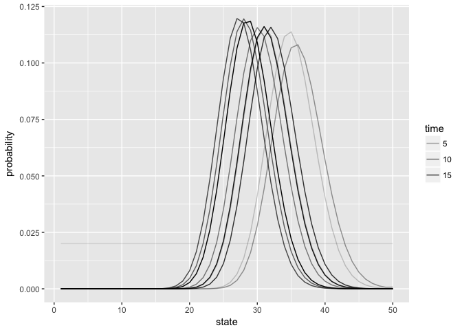

[](https://travis-ci.org/boettiger-lab/sarsop) [](https://ci.appveyor.com/project/boettiger-lab/boettiger-lab/branch/master) [](https://codecov.io/github/boettiger-lab/sarsop?branch=master) [](http://www.repostatus.org/#active) [](https://cran.r-project.org/package=sarsop)

<!-- README.md is generated from README.Rmd. Please edit that file -->
SARSOP for R
============

``` r
library(sarsop)
library(tidyverse) # for plotting
```

Problem definition
------------------

Our problem is defined by a state space, `states`, representing the true fish stock size (in arbitrary units), and an action space, `actions` representing the number of fish that will be harvested (or attempted to harvest). For simplicitly, we will permit any action from 0 harvest to the maximum possible state size.

A stock recruitment function, `f` describes the expected future state given the current state. The true future state will be a stochastic draw with this mean.

A reward function determines the value of taking action of harvesting `h` fish when stock size is `x` fish; for simplicity this example assumes a fixed price per unit harvest, with no cost on harvesting effort. Future rewards are discounted.

``` r
states <- seq(0,1, length=50)
actions <- states
observations <- states
sigma_g <- 0.1
sigma_m <- 0.2
reward_fn <- function(x,h) pmin(x,h) # - .001*h
discount <- 0.95

r <- 1
K <- 0.75
f <- function(x, h){ # ricker
  s <- pmax(x - h, 0)
  s * exp(r * (1 - s / K) )
}
```

Semi-analytic solution to Deterministic problem
-----------------------------------------------

For comparison, we note that an exact solution to the deterministic or low-noise problem comes from Reed 1979, which proves that a constant escapement policy *S*<sup>\*</sup> is optimal, with $\\tfrac{df}{dx}|\_{x = S^\*} = 1/\\gamma$ for discount *γ*,

``` r
S_star <- optimize(function(x) -f(x,0) + x / discount, 
                   c(min(states),max(states)))$minimum
det_policy <- sapply(states, function(x) if(x < S_star) 0 else x - S_star)
det_action <- sapply(det_policy, function(x) which.min(abs(actions - x)))
```

When the state is observed without error, the problem is a Markov Decision Process (MDP) and can be solved by stochastic dynamic programming (e.g. policy iteration) over the discrete state and action space. To do so, we need matrix representations of the above transition function and reward function.

`sarsop` provides a convenience function for generating transition, observation, and reward matrices given these parameters for the fisheries management problem:

``` r
m <- fisheries_matrices(states, actions, observations, reward_fn, 
                        f, sigma_g, sigma_m, noise = "lognormal")
```

POMDP Solution
--------------

In the POMDP problem, the true state is unknown, but measured imperfectly. We introduce an observation matrix to indicate the probabilty of observing a particular state *y* given a true state *x*. In principle this could depend on the action taken as well, though for simplicity we assume only a log-normal measurement error independent of the action chosen.

Long-running code to actually compute the solution.

``` r
log_data <- data.frame(id = "vignette", model = "ricker", 
                       r = r, K = K, sigma_g = sigma_g, sigma_m = sigma_m)

alpha <- sarsop(m$transition, m$observation, m$reward, discount, 
                log_data = log_data, log_dir = ".",
                precision = .1, timeout = 20000)
```

`sarsop` logs solution files in a specificied directory, along with a metadata table. The metadata table makes it convenient to store multiple solutions in a single directory, and load the desired solution later using it's id or matching metatata. We can read this solution from the log where it is stored. (For convience, a cached copy of the above long-running result is shipped with the package.)

``` r
log_dir <- system.file("ext-data/vignette-log", package = "sarsop")
meta <- meta_from_log(data.frame(id = "vignette"), log_dir)

alpha <- alphas_from_log(meta, log_dir)[[1]] ## bc fn returns a list with all matching alphas, we need [[1]]
```

Given the model matrices and `alpha` vectors. Start belief with a uniform prior over states, compute & plot policy:

``` r
state_prior = rep(1, length(states)) / length(states) # initial belief
df <- compute_policy(alpha, m$transition, m$observation, m$reward,  state_prior)

## append deterministic action
df$det <- det_action
```

``` r
ggplot(df, aes(states[state], states[state] - actions[policy])) + 
  geom_line(col='blue') + 
  geom_line(aes(y = states[state] - actions[det]), col='red')
```



Simulate management under the POMDP policy:

``` r
x0 <- which.min(abs(states - K))
Tmax <- 20
sim <- sim_pomdp(m$transition, m$observation, m$reward, discount, 
                 state_prior, x0 = x0, Tmax = Tmax, alpha = alpha)
```

Plot simulation data:

``` r
sim$df %>%
  select(-value) %>%
  mutate(state = states[state], action = actions[action], obs = observations[obs]) %>%
  gather(variable, stock, -time) %>%
  ggplot(aes(time, stock, color = variable)) + geom_line()  + geom_point()
```



Plot belief evolution:

``` r
sim$state_posterior %>% 
  data.frame(time = 1:Tmax) %>%
  filter(time %in% seq(1,Tmax, by = 2)) %>%
  gather(state, probability, -time, factor_key =TRUE) %>% 
  mutate(state = as.numeric(state)) %>% 
  ggplot(aes(state, probability, group = time, alpha = time)) + geom_line()
```



------------------------------------------------------------------------

Developer Notes
===============

Unfortunately the appl source code is a bit dated and not suitable for using as a shared library. It builds with lot of warnings and on Windows it only builds with MS Visual Studio. This package tries to make things as easy as possible for the user by bunding the appl executables and wrap them with `system` calls in R. This package also provides higher-level functions for POMDP analysis.

Thanks
------

Mykel Kochenderfer and Markus Herrmann have been helpful in providing windows builds using MS Visual Studio:

-   <http://web.stanford.edu/group/sisl/resources/appl-0.96-win-win32.zip>
-   <http://web.stanford.edu/group/sisl/resources/appl-0.96-win-x64.zip>

------------------------------------------------------------------------

[](http://ropensci.org)
